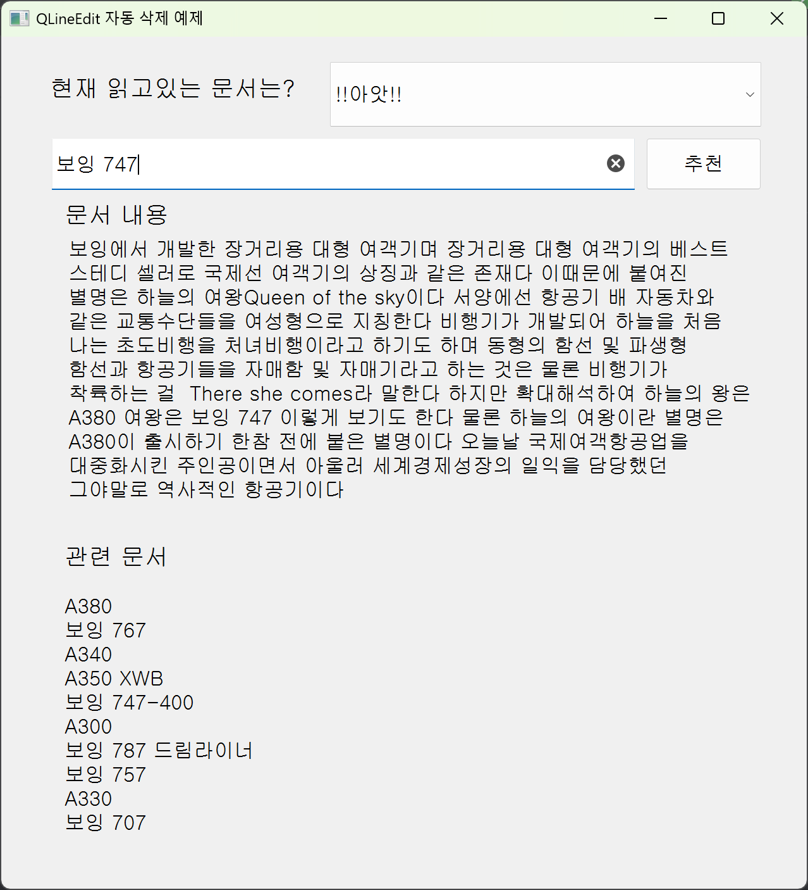
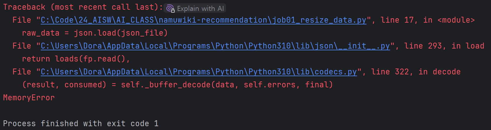

# NAMU-Branch
250110 ~ 250112 intel_AISW 아카데미 프로젝트

<br/>

현재 열람중인 나무위키 문서와 연관된 문서를 자동 추천해주는 프로젝트 입니다.


TF-IDF와 Word2Vec 임베딩을 이용해 추천 알고리즘을 구축하였고,
PyQt5를 이용해 UI를 제작해 시각화를 진행했습니다.



<br/>

## 라이센스

본 프로젝트에서는 [나무위키 덤프 데이터](https://namu.wiki/w/%EB%82%98%EB%AC%B4%EC%9C%84%ED%82%A4%20MDict)를 사용하였습니다.  
해당 데이터는 **CC-BY-NC-SA 2.0 KR 라이선스**에 따라 제공됩니다.

### 데이터 출처 및 라이선스
- **데이터 출처:** [나무위키 MDict 덤프](https://namu.wiki/w/%EB%82%98%EB%AC%B4%EC%9C%84%ED%82%A4%20MDict)
- **라이선스:** [CC-BY-NC-SA 2.0 KR](https://creativecommons.org/licenses/by-nc-sa/2.0/kr/)
- **사용 목적:** 비영리 연구 및 학습용

### 라이선스 조건
본 프로젝트는 **비영리적인 목적으로 진행**되었으며, 다음과 같은 조건을 준수합니다:
1. **저작자 표시 (BY):** 데이터를 사용할 때 반드시 출처를 명시해야 합니다.  
2. **비영리 목적 (NC):** 상업적 이용은 금지됩니다.  
3. **동일조건 변경허락 (SA):** 가공된 데이터를 공유할 경우 동일한 라이선스를 적용해야 합니다.  

<br/>

## 목차

- 개요
- 목표
- 디렉토리 구조
- 작업 프로세스
- 문제점과 해결방법
- 프로젝트 이후 방향

<br/>

## 프로젝트 개요

나무위키 대부분의 문서에는 관련 문서라는 문단에 현재 문서와 연관되어있는 문서의 하이퍼링크가 달려 있습니다.


하지만, 해당 문단은 문서 작성자가 임의로 추가하는 형식이므로 모든 문서에 관련문서 문단이 없는 문서도 있습니다.


 문서를 읽으면서 해당 문서와 비슷한 주제의 글을 읽고 싶을 때, 추천해주는 프로그램이나 문서 안의 문단이 존재 했으면 좋겠다는 생각을 한 적이 있었고,
TF-IDF 실습을 하면서 위의 아쉬웠던 경험을 개선하는 프로그램을 안들 수 있겠다는 기대감을 안고 프로젝트를 진행 했습니다.

<br/>

실습에 사용할 데이터는 나무위키에서 제공한 가장 최근 덤프 파일(210301, json)을 사용했으며,
약 8.8GB의 파일을 한번에 다루기에는 작업환경 제약이 많아 2%만 추출해서 실습했습니다.

<br/>

## 프로젝트 목표

### NAMU-Branch

**열람중인 문서와 유사한 문서를 추천해주는 프로그램**

- 열람중인 문서와 유사한 문서 추천
- 키워드 검색으로 문서 추천
- 열람중인 문서 개요 출력

<br/>

### 열람중인 문서와 유사한 문서 추천

#### TF-IDF => "문서간 벡터 비교"

- 문서 전체를 형태소로 분리 후 TF-IDF로 벡터화
- 문서의 TF-IDF 벡터로 다른 문서와 유사도 비교
- 같은 주제의 문서 추천

<br/>

### 키워드 기반 문서 추천

#### Word2Vec => "키워드와 유사한 단어 추출"

- 키워드 기반 검색을 위해 문서에 나오는 단어 임베딩
- 입력 단어와 유사한 단어를 Word2Vec으로 찾은 후, TF-IDF 벡터화하여 비교
- 연관 키워드 기반 문서 추천

<br/>

## 디렉토리 구조
```commandline
NAMU-Branch
├─data
│  ├─raw_data
│  │  └─namuwiki_20210301.json
│  ├─namuwiki_downsize.json
│  └─namuwiki_cleand_data.csv
├─format_files
│  ├─malgum.ttf
│  └─stopwords_kor.csv
├─models
│  ├─tfidf.pickle
│  ├─Tfidf_namuwiki.mtx
│  └─word2vec_namuwiki.model
├─src_img
│  └─image_directory
├─job01_resize_data.py
├─job02_data_preprocessing.py
├─job03_TF-IDF.py
├─job04_word2vec.py
├─job05_recommendation.py
├─job06_ui_recommendation_improve.py
├─job_sub_visualization_for_data_management_model_validation.py
├─job_sub_wordcloud_for_data_management_model_validation.py
├─temp_overview.py
├─namu_recommendation.ui
├─README.md
├─requirements.txt
└─model_validation
   ├─job01_1_resize_data_model_validation.py
   ├─job02_1_data_preprocessing_model_validation.py
   ├─job03_1_TF-IDF_model_validation.py
   ├─job04_1_word2vec_model_validation.py
   └─job05_1_recommendation_model_validation.py
```

<br/>

## 작업 프로세스

- 덤프 파일 2%로 다운사이징
- 데이터 전처리
- TF-IDF로 벡터화, Word2Vec로 임베딩 모델 생성
- UI로 추천 프로그램 구현

<br/>

### 덤프 파일 2%로 다운사이징

#### **job01_resize_data.py**

덤프 파일을 바로 사용하기엔 용량이 매우 커서 10%만 추출해서 사용하는 과정

2% 추출 기준은 리스트에서 50의 몫인 번호에 해당하는 행을 추출해서 './data' 디렉토리에 'namuwiki_downsize.json' 파일로 저장합니다.
 
<br/>

추출된 데이터의 행의 수: 16,014 

**주의사항**
해당 코드는 32GB 이상 메모리가 필요합니다!

<br/>

### 데이터 전처리

#### **job02_data_preprocessing.py**

추출된 json 파일을 pandas, Okt, re, numpy를 이용해서 데이터 전처리를 진행합니다.

- 한글(가 ~ 힣)에 포함된 문장만 남기고 제거합니다.
- Okt로 토큰화를 진행합니다.
- 명사, 동사, 형용사 이외의 토큰은 제거합니다.
- stopword에 포함된 단어와 2글자 미만의 단어, stopword에 포함되지 않은 쓰레기 데이터를 제거합니다.
- 내용이 비어있거나 100토큰 미만의 데이터도 드랍합니다.

100 토큰 미만의 데이터는 의미분석이 안되고 노이즈 데이터가 될 가능성이 높기에 제거했습니다.

데이터의 행의 수: 16,014 => 11,384

<br/>

### TF-IDF로 벡터화, Word2Vec로 임베딩 모델 생성

#### **job03_TF-IDF.py**

토큰화 된 데이터를 벡터화하는 코드

문서를 벡터화 하여 관련도가 높은 문서를 판펼하기 위한 작업입니다.

16,014개의 데이터 기준으로 단어 제한 없이 진행했을 때, 토큰의 수는 139,827개로 과하게 많아서, 

프로그램 정확도를 유지하면서 아래와 같이 제한을 걸고 진행했습니다.

이후 TF-IDF를 다시 진행 했을 때,
- 문서당 단어 갯수를 2,000개로 제한했다.
- 문서에 5번 이하로 언급되는 단어는 제외한다. => 희귀단어 제거
- 80% 이샹 문서에서 등장한 단어는 제외한다.

<br/>

#### **job04_word2vec.py**

토큰화 된 데이터를 이용하여 임베딩 모델을 생성하는 과정

문서에서 출현하는 토큰으로 임베딩 모델을 생성하여 키워드 검색 시, 유사도가 가장 높은 문서를 TF-IDF 벡터화와 연계하기 위한 모델 생성 작업입니다.

임베딩 모델을 생성하는 과정에서 시간이 너무 오래 걸려 학습 알고리즘을 Skip-gram 모델에서 CBOW 모델로 변경했습니다.

이 둘의 차이점은 아래와 같습니다.

<br/>

#### Word2Vec 모델: Skip-gram vs. CBOW

| 모델      | 학습 방식 | 장점 | 단점 | 용도                   |
|-----------|---------------------------------|--------------------------------|--------------------------------------|----------------------|
| **Skip-gram** | 중심 단어 → 주변 단어 예측 | 드문 단어에 대해 더 나은 결과 | 속도가 느림 | 작은 데이터셋, 희귀 단어 학습 필요 |
| **CBOW** | 주변 단어 → 중심 단어 예측 | 빠르고 효율적 | 희귀 단어 처리 성능이 낮음 | 대량의 데이터셋, 빠른 학습 필요   |

<br/>

### UI로 추천 프로그램 구현

#### **job05_recommendation.py**

PyQt5를 이용하여 추천 프로그램을 구현했습니다. 

모델 검증 단계에서 사용한 UI입니다.

#### **job06_ui_recommendation_improve.py**

위 구현된 UI에서 더 사용자 친화적으로 변경했습니다.

<br/>

## 문제점괴 해결방법

### 1. 원본 데이터 축소의 어려움

처음에 원본 데이터에서 모델 검증에 필요한 데이터를 추출할 때, 노트북 환경(16GB 메모리)은 메모리 부족 경고가 뜨면서 데이터 추출을 할 수가 없었습니다.



**해결 방법**

32GB의 메모리를 가진 컴퓨터에서 추출을 진행했습니다.

json 파일을 순차적으로 로드해서 작업을 진행하려 했으나, 해당 덤프 파일은 jsonl 형식이 아닌 json 파일이기에,
순차적으로 로드하지 못하고 한번에 로드해야 하기에, 32GB 메모리를 가진 컴퓨터에서 추출을 진행했습니다.

<br/>

### 2. 문서 벡터화 방식

문서를 벡터화 하는 과정에서 문서의 내용이 축약된 개요만 사용해서 벡터화를 진행했습니다.

하지만 문서의 개요는 50자 미만 ~ 450 자 이상 등등 다양했지만, 

개요가 짧은 문서는 형태소 변환 이후 토큰이 매우 적어서 문서 벡터화 후 유사도 검증에서 정확도가 전혀 사용 불가능한 수준으로 구현되었습니다.


**해결 방법**

이는 작업이 오래 걸리더라도 문서 전체를 벡터화 하면서 해결했습니다.

<br/>

### 3. 형태소 처리와 노이즈 데이터 제거

모델 검증 단계에서 전혀 상관이 없는 문서가 추천되는 경우가 발생횄고, 

이를 확인하기 위해 wordcloud를 이용해 해당 문서의 토큰과 벡터를 확인해 본 결과

- 형태소 처리 단계에서 쓸모없는 토큰이 생성됨


Okt를 이용해서 형태소로 분리 후, 명사, 동사, 형용사 이외의 토큰은 제외했지만,

"되었다" => "되어다" 라는 토큰이 생성되어 wordcloud에서 2 ~ 3번째로 큰 벡터로 확인이 되는 경우가 발생했습니다.


**해결 방법**

이는 stopword에도 없던 토큰이기에, 직접 삭제하는 코드를 추가했습니다.


- 100 토큰 미만의 데이터의 노이즈


이후 다시 모델 검증 단계에서 또 전혀 상관이 없는 데이터가 추천되는 경우가 발생하였고,

이는 토큰수가 극히 적은 데이터의 노이즈였습니다.

**해결 방법**

전처리 단계에서 100 토큰 미만의 데이터는 제외함으로 해결했습니다.

문서의 갯수가 16,014 => 11,384로 데이터가 약 71%로 줄었습니다.

<br/>

### 4. Word2Vec 임베딩 모델 생성 문제

전처리 이후 임베딩 모델을 생성 했으나 너무 많은 시간이 소요되었습니다.

또한 차원이 너무 많아서 모델 속도가 느려서 차원을 줄였습니다.

이전에 사용하던 알고리즘은 Skip-gram 모델을 사용했습니다.

하지만 프로젝트 기간상 시간이 부족했기에 CBOW 모델로 변경해서 사용했습니다.

<br/>

## 프로젝트 이후 방향

- UI 개요 스크롤바 추가
- 벡터화와 임베딩 모델 학습을 위한 CSV 파일과 개요가 포함된 CSV 파일 통합

